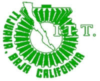
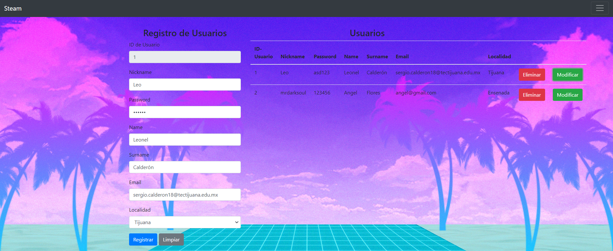
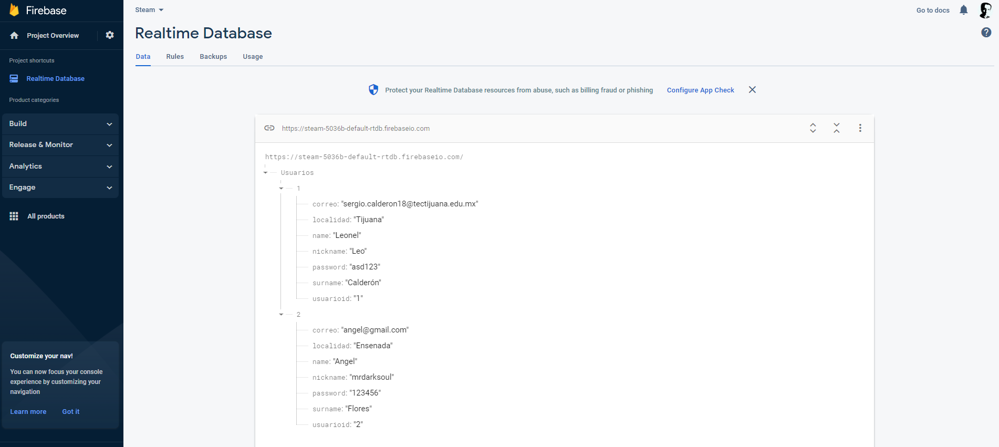

  

## Tecnológico Nacional de México
## Instituto Tecnológico de Tijuana
## Subdirección Académica
## Departamento de Sistemas y Computación

## FEB - JUN 2023

## Carrera:
#### Ingeniería en Sistemas Computacionales

## Materia y Serie:
#### Programación Web | AEB-1055

## Tarea2: JS + Firebase

## Unidad I

## Alumno y Número de Control:
#### Calderón Gastelum Sergio Leonel - 18212153

## Docente:
#### Dra. Daniela Adriana Sánchez Vizcarra.

## Fecha de Entrega:
#### Viernes, 24 de febrero de 2022

---

# Introducción
Para esta práctica, se hará uso de una base de datos en la nube haciendo uso de la plataforma de firebase. Con firebase nos permitirá
reflejar los datos que se almacenen en nuestra tabla de la práctica en JS y por medio de la API_Key que se genera al crear un nuevo proyecto en la plataforma nos permitirá guardar de igual forma los datos en la nube. El objetivo de esta práctica es básicamente hacer funcionar tanto el almacenamiento de los datos en la tabla creada como almacenarlas en la base de datos por firebase, en este caso implementaremos 7 campos los cuales el usuario deberá ingresar para poder guardarlos con éxito mediante la temática de Steam (Plataforma de videojuegos).

---

# Contenido
## Pantallas Principales

Figura 1. Pantalla de index.html, se realizan los registros de los usuarios de la plataforma

Figura 2. Pantalla de consulta.html, se buscan los usuarios registrados en base a la localidad (Tijuana).

Figura 3. Pantalla de consulta.html, se buscan los usuarios registrados en base a la localidad (Ensenada).

Figura 4. Pantalla de la base de datos en Firebase con los datos de las tablas en el JS.

## Código Principal

## Enlace del repositorio

# Conclusión